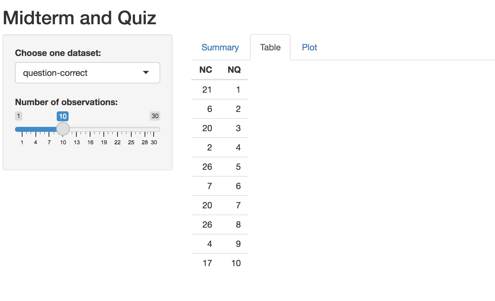
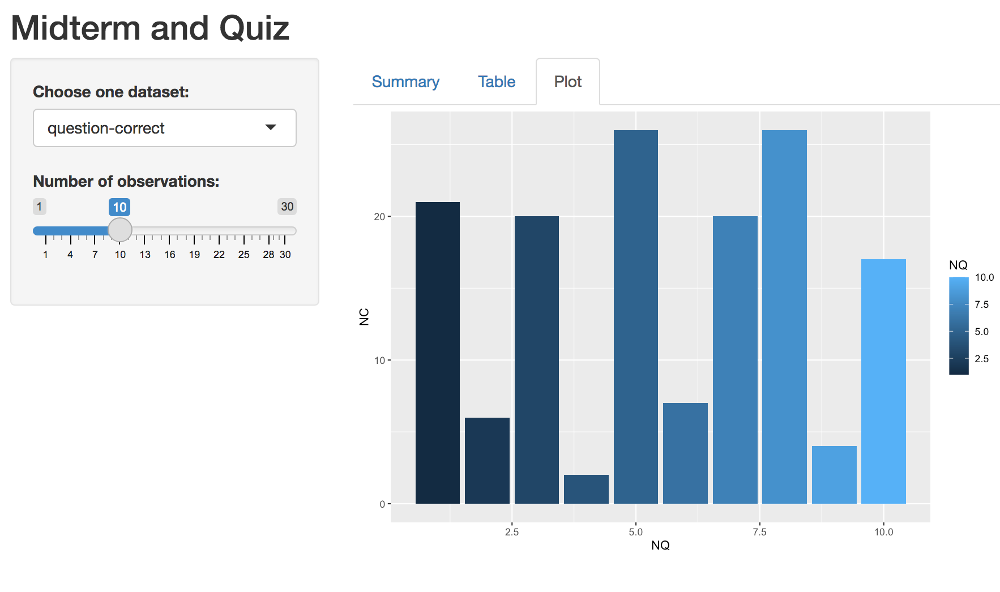

# Interactive-Visualization-Project

The purpose of this project is to visualize the relationsips between student's performance in different types of test items, midterm-results and quiz-categories.

The original datasets are quiz-categories.csv and midterm-result.csv which can also be found in this github repository.

## Random Histogram Generator

We will build another Shiny App one piece at a time. This app will generate a histogram based on random values drawn from a normal distribution, the user will be able to select the number of draws that generate the histogram by using a slider.

## Final Project

Finally, build an interactive visualization using the data sets quiz-categories.csv and midterm-results.csv. These data represent midterm results from an open book test. Deploy your dashboard to the Shiny Apps hosting service. 

The categories represent the skills required to answer each question:

wrangling - Question required data manipulations skills  
coding - Question required coding skills  
d.trees - Question invoilved decision trees  
sna - Question involved social network analysis  
nlp - Question involved natural language processing  
viz - Question involved visualization of data  
n.nets - Question involved neural nets  
googleable - Question could be answered by searching the internet  
non-googleable - Question could not be answered through simple searching of the internet
jitl - Question involved learning somethimg new (just in time learning)  
substantive - Question involved wrestling with a complex idea that does not have a definitive answer

## Here are the visulizations of this project

## Tools

* [R](https://www.r-project.org)
* [RStudio](https://www.rstudio.com)
* [Shiny](https://www.rstudio.com/products/shiny-2/)- An open source R package that provides an web framework for building web applications using R
* [Shinyapps.io](https://www.shinyapps.io/)- A platform to put your Shiny applications without having to set up a Shiny Server in advance
* [RecordIt](http://recordit.co) - An application helps you turn screen records into gif files

## Author

[Junhao Zhang](https://www.linkedin.com/in/junhao-zhang-07632b209/) - Learning Analytics MS student at Teachers College, Columbia University